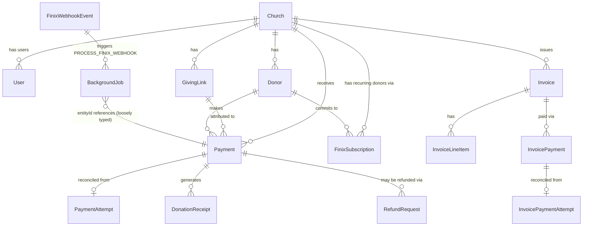

# Architecture

> See also: [`README.md`](./README.md) for setup, [`../codebase-analysis-docs/CODEBASE_KNOWLEDGE.md`](../codebase-analysis-docs/CODEBASE_KNOWLEDGE.md) for module-by-module detail, [`DATA_MODELS.md`](./DATA_MODELS.md) for the schema.

## Governing principle

This codebase is explicit, in comments throughout, about one non-negotiable rule:

> **WGC is allowed to become slower under load. It is never allowed to become financially incorrect.**

Every architectural choice below — the durable outbox, the transactional-Payment-plus-jobs pattern, the reconciliation sweeps, the never-retry-a-second-charge rule — exists in service of that rule.

## Subsystems

### 1. The Next.js monolith

There is one deployable: a Next.js App Router application. It serves:
- **Public pages** (marketing, giving links, invoice payment pages, merchandise storefronts) — `src/app/(public routes)`
- **Merchant dashboard** — `src/app/merchant/(dashboard)/**`, session-gated
- **Admin console** — `src/app/admin/(dashboard)/**`, session-gated, WGC-internal only
- **API routes** — `src/app/api/**/route.ts`, used by both the dashboards (as their own backend) and external callers (Finix webhooks, QuickBooks OAuth callbacks, cron)

There is no separate API server, no microservices, and no message broker. "Async work" is modeled as rows in Postgres tables, not queue messages.

### 2. The payment processor boundary (Finix)

All money movement goes through Finix. `src/lib/finix/client.ts` is a hand-written typed wrapper around Finix's REST API (Basic Auth, `FINIX-VERSION` header) — there is no official Finix Node SDK in use. Every Finix-facing write (`createTransfer`, `createSubscription`, `createBuyerIdentity`, etc.) is treated as **externally irreversible and non-idempotent-by-default**: the codebase's own idempotency keys, unique DB constraints, and reconciliation logic are what make retries safe, not any assumption about Finix's own behavior.

### 3. The durable background-job outbox

Introduced to replace "do the financial write, then `await` a receipt email/QuickBooks sync inline, and hope the process doesn't die in between." The pattern (see `src/lib/jobs/backgroundJobs.ts`):

1. A financial mutation (e.g. `Payment.create`) and its required follow-up work (e.g. `SEND_RECEIPT`, `QUICKBOOKS_PAYMENT`) are written in **one** `prisma.$transaction` — both commit or neither does.
2. Follow-up work is a row in `BackgroundJob`, not a direct function call. Enqueue is idempotent via a `@unique` `dedupeKey` column (P2002-safe, not select-then-insert).
3. A worker (invoked via an authenticated internal endpoint, `POST /api/internal/jobs/run`, itself triggered by Vercel Cron or a manual call) claims a batch with a single `UPDATE ... WHERE id IN (SELECT ... FOR UPDATE SKIP LOCKED)` statement — safe for many concurrent Vercel instances to call simultaneously.
4. A job that fails retries with exponential backoff up to `maxAttempts`, then is marked `FAILED` — never retried forever.
5. A worker that dies mid-job leaves it `PROCESSING` with a lease (`leaseUntil`); a stale-lease sweep reclaims it back to `RETRY`.

### 4. The Finix-webhook fast-ack ingress/worker split

`src/app/api/webhooks/finix/route.ts`'s `POST` handler does the **minimum** needed to durably accept a webhook:
authenticate (Basic Auth / Bearer / HMAC signature) → parse minimally → **in one transaction**, persist the `FinixWebhookEvent` row **and** enqueue its `PROCESS_FINIX_WEBHOOK` background job → return `200`.

The actual business logic — the additive Finix data sync (transfers/disputes/settlements), Payment creation/status transitions, onboarding-application status changes, emails — lives in `processFinixWebhookEvent()`, exported from the same file but run by the job worker, off the request path. This means:
- Finix always gets a fast, reliable `200` (or an honest failure that makes Finix retry) regardless of how long the actual processing takes.
- A crash between "event persisted" and "job runs" is impossible — the same transaction created both.
- A crash mid-processing is safe to retry: `processFinixWebhookEvent` re-derives everything from the persisted event and short-circuits if `processingStatus` is already `COMPLETED`.

### 5. Reconciliation sweeps

`src/lib/reconciliation/*.ts` — scheduled workers (via `/api/cron/reconcile-payments`, `-invoice-payments`, `-refunds`) that discover and **repair** financial state Finix already resolved but WGC's local write never landed (a crash between "Finix confirmed the charge" and "the local `Payment` row committed"). Governing rule: **a reconciler may repair, it may never re-attempt the original financial mutation** — there is no `createTransfer`/`createReversal` call anywhere in the reconciliation modules; they only call read-only Finix lookups (`getTransfer`, `listTransferReversals`, `findTransferByIdempotencyId`) and then apply the *discovered* real-world result to WGC's own tables, transactionally, alongside any downstream jobs.

### 6. WGC's own platform billing

Layered independently on top of the church-facing product: WGC bills each `Church` a subscription (`WgcSubscription`, `WgcBillingAccount`, `BillingCharge`) using the *same* Finix platform account but a separate code path (`src/lib/billing/`). A church whose WGC billing is unpaid gets a restricted-access gate (`resolveOrgAccessState` in `src/lib/billing/accessGate.ts`) enforced in `requireMerchantSession()` — this is unrelated to whether the church's own donors can still be charged.

## Data flow: the main donation request path

```mermaid
sequenceDiagram
    participant Donor
    participant GivingPage as Public Giving Page
    participant API as /api/g/[slug]/donate
    participant Finix
    participant DB as Postgres
    participant Worker as Job Worker
    participant Webhook as /api/webhooks/finix

    Donor->>GivingPage: Submits donation form
    GivingPage->>API: POST amount, tokenized instrument
    API->>DB: Create PaymentAttempt (idempotencyId)
    API->>Finix: POST /transfers (charge)
    Finix-->>API: Transfer result (or timeout/ambiguous)
    alt Finix confirms synchronously
        API->>DB: Transaction: Payment.create + enqueue SEND_RECEIPT/QUICKBOOKS_PAYMENT
        API-->>Donor: Success
    else Ambiguous / process dies before local write
        API-->>Donor: PAYMENT_STATUS_UNCERTAIN (never retries the charge)
    end
    Finix->>Webhook: transfer.created / transfer.updated webhook
    Webhook->>DB: Transaction: persist FinixWebhookEvent + enqueue PROCESS_FINIX_WEBHOOK job
    Webhook-->>Finix: 200 (fast ack)
    Worker->>DB: Claim PROCESS_FINIX_WEBHOOK job
    Worker->>DB: Apply transfer state to Payment (idempotent; recovers an orphaned Payment if the API path never wrote one)
    Worker->>DB: Enqueue SEND_RECEIPT / QUICKBOOKS_PAYMENT (dedupeKey-safe — no duplicate if already enqueued above)
    Worker->>DB: Mark job COMPLETED
```

## System architecture overview

```mermaid
flowchart TB
    subgraph Public
        Donor((Donor / Payer))
        GivingPage[Giving Link / Invoice Pay Page]
    end

    subgraph NextApp[Next.js App — single deployable]
        MerchantUI[Merchant Dashboard]
        AdminUI[Admin Console]
        APIRoutes[API Routes]
        Worker[Background Job Worker\nPOST /api/internal/jobs/run]
        Cron[Vercel Cron routes\n/api/cron/*]
    end

    subgraph DB[(Postgres via Prisma)]
        Core[Church / User / Payment / Donor / ...]
        Outbox[BackgroundJob]
        WebhookLog[FinixWebhookEvent]
    end

    Finix[[Finix\nPayment Processor]]
    Resend[[Resend\nEmail]]
    QBO[[QuickBooks Online]]
    Aplos[[Aplos]]
    Printful[[Printful]]

    Donor --> GivingPage --> APIRoutes
    MerchantUser((Merchant User)) --> MerchantUI --> APIRoutes
    AdminUser((WGC Admin)) --> AdminUI --> APIRoutes

    APIRoutes <--> DB
    APIRoutes --> Finix
    Finix -- webhooks --> APIRoutes
    APIRoutes --> Outbox
    Worker --> Outbox
    Worker --> Resend
    Worker --> QBO
    Worker --> Aplos
    Cron --> DB
    Cron --> Finix
    APIRoutes --> WebhookLog
```

## Entity relationships (core payments slice)



> Note: `BackgroundJob.entityId`/`entityType` are intentionally loose string references (not a Prisma relation) — a job can point at a `Payment`, an `InvoicePayment`, a `FinixWebhookEvent`, etc. This is deliberate (one generic outbox table for every entity kind) but means Prisma's schema itself doesn't enforce referential integrity there; correctness relies on the enqueue call sites always passing a real id.

## Layered/domain patterns in use

- **No repository/service/controller layering.** Route handlers call functions in `src/lib/**` directly; there's no dedicated "repository" abstraction over Prisma — `prisma` (the singleton client, `src/lib/prisma.ts`) is called directly from both route handlers and lib functions.
- **Domain modules, not technical layers.** `src/lib/` is organized by business domain (`giving/`, `invoices/`, `donors/`, `billing/`, `payments/`, `reconciliation/`) rather than by technical role (`services/`, `repositories/`).
- **Transactional outbox** for every financial mutation that has required side effects (see subsystem 3 above) — this is the closest thing to a formal architectural pattern in the codebase, and it is the one enforced most consistently.
- **Idempotency by database constraint, not application logic.** Nearly every "can this happen twice?" concern is answered by a `@unique` Prisma constraint (`Payment.finixTransferId`, `BackgroundJob.dedupeKey`, `RefundRequest @@unique([finixTransferId, clientRefundId])`, `PaymentAttempt.idempotencyId`) plus a P2002-catch-and-recover pattern, rather than locks or distributed coordination.
